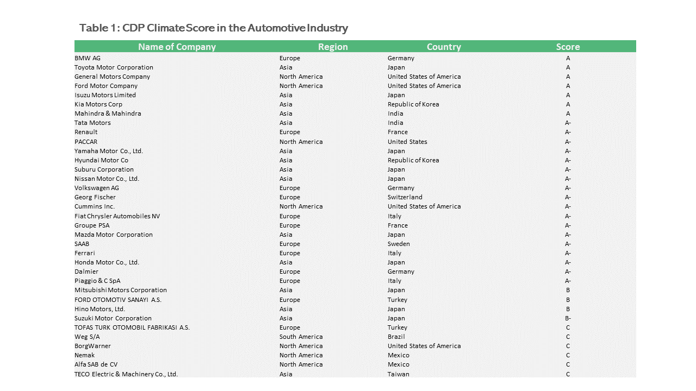
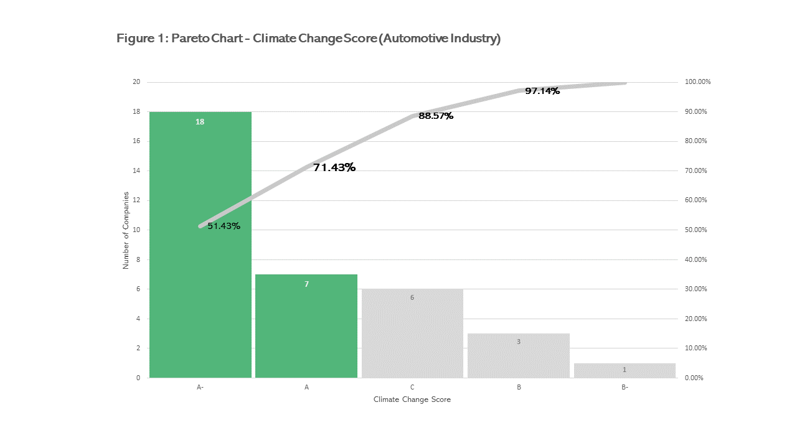
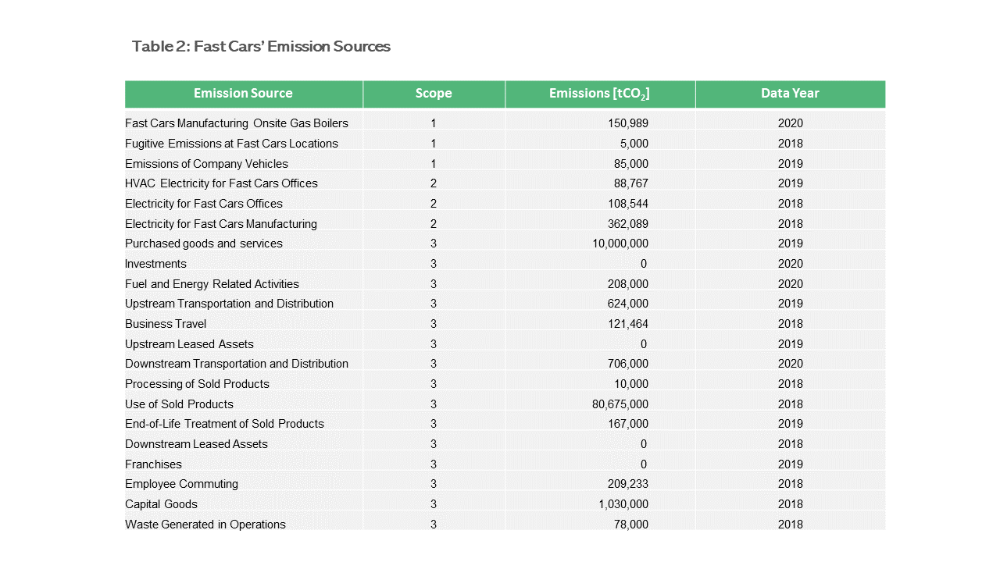
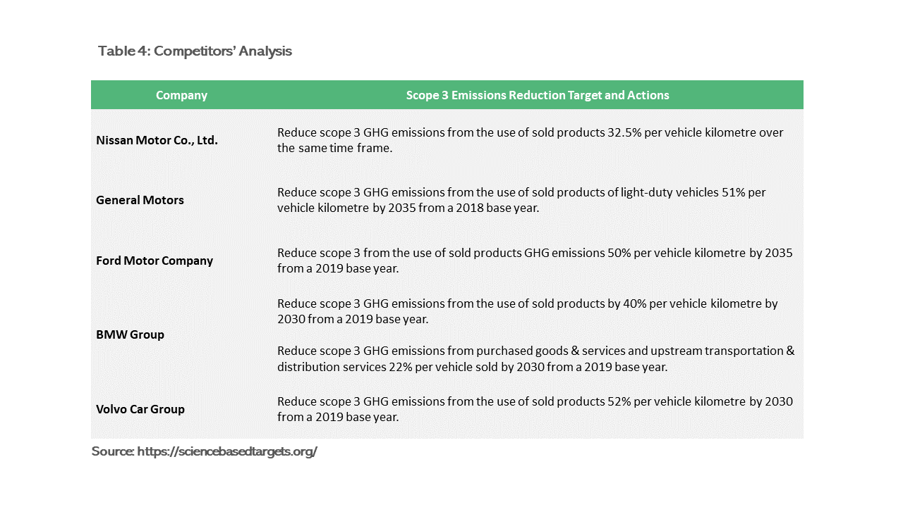
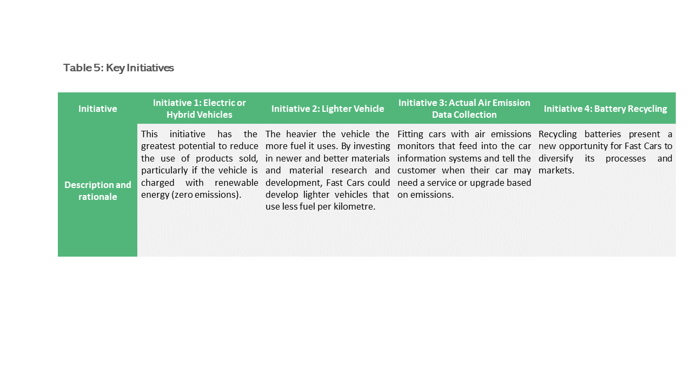

# Science Based Target initiative (SBTi) emissions reduction

## Table of contents
- [Summary](#summary)
- [Problem Statement](#problem-statement)
- [Benchmark Assessment](#benchmark-assessment)
- [Scope 1 & Scope 2 emissions reduction](#scope-1-&-Scope-2-emissions-reduction)
- [Scope 3 Science based targets and initiatives](#scope-3-science-based-targets-and-initiatives)

## Summary
- Fast Cars is performing worse than most of the companies in the automotive industry.
- Fast Cars’ manufacturing sites and onsite gas boilers are major contributors of Scope 1 and Scope 2 emissions.
- To reduce Scope 1 and Scope 2 emissions, the company should consider switching to renewable energy in the manufacturing process and heat production.
- The greatest proportion of Scope 3 emissions occur at the downstream portion, particularly the use of sold products. The same pattern is also found across the whole automotive industry.
- The company should plan the production of electric or hybrid vehicle lines, R&D on lightweight materials that reduce the weight of a vehicle and fuel consumption, installation of air emission data collection, and implementation of batteries recycling initiative. 

## Problem Statement 
Fast Cars (a hypothetical company) has engaged BCG to help deliver on its Science Based Target initiative (SBTi). The company is under pressure from investors to address climate change and expects new regulations to mandate the phase-out of Internal Combustion Engines (ICE) used in cars.

## Benchmark Assessment
According to the climate score data of the automotive industry provided by CDP in **table 1**, it is found that there are 35 companies having scores greater than, equal to, and below Fast Cars’ score of B.

The Pareto chart shows that out of the total;
- 25 companies (approx. 71%) score better than Fast Cars (A & A-),
- 3 companies (approx. 9%) score the same as Fast Cars (B), and
- 7 companies (approx. 20%) score worse than Fast Cars (B- & C)

This analysis suggests that Fast Cars is performing worse than most of the companies in the automotive industry. Hence, there is still room for improvement for the company to advance into an A score list. One possible way is to look at all the emission targets of companies that are graded higher (A and A-).

## Scope 1 & Scope 2 emissions reduction
**Table 2** shows the emission sources of Fast Cars.  According to the provided data of Fast Cars, the major contributors of scope 1 and scope 2 come from two main sources: purchased electricity being used at Fast Cars’ manufacturing sites and onsite gas boilers. 

The following are interventions to address the emission sources.  

**Emissions Source: Scope 2 Electricity for Fast Cars Manufacturing**
*Initiative: Renewable Power in Production (40-55% abatement lever)*

Purchased electricity for manufacturing makes up most of Fast Cars’ scope 2 emissions. Fast Cars can transition its manufacturing facilities to renewable power to significantly reduce carbon emissions at all its sites. This approach can be coupled with investment in energy efficiency measures to reduce its overall energy demands. 

Fast Cars could also influence its suppliers to transition to renewable energy; for example, Fast Cars could require and support its aluminium to decarbonize the processes. All companies in the value chain will benefit from the same decarbonized aluminium.

*Case Study*
- From 2022, Mercedes-Benz committed to becoming CO2 neutral in its operations in Germany and Europe with renewable energy supply. This is achieved through the installation of a photovoltaic system.
- The company is also requiring its suppliers to adopt the standards for decarbonization.

*Initiative: Renewable Power and New Processes in Battery Production (40-55% abatement lever)*

It is expected that Fast Cars planned to have electric vehicle lines coming into the market, in line with the climate trends and regulations. The energy intensity of battery production will significantly increase its carbon emissions. For example, producing a BEV can generate up to 60% more CO2 emissions than producing a comparable ICE. 
Fast Cars should consider switching to renewable energy in its battery production sites or prioritizing factories that are supplied with renewable energy in its battery supply chain to pave its commitment to becoming Co2-neutral. 

**Emissions Source: Scope 1 Fast Cars Manufacturing Onsite Gas Boilers**
*Initiative: Renewable Heat (40% abatement lever)*

Fast Cars currently use onsite gas boilers for heat production in their manufacturing processes. This makes up the greatest proportion of the company’s scope 1 emissions. There are several options to reduce or eliminate these emissions that we could recommend to Fast Cars. These include using high-efficiency burners that recover and use waste heat, as well as using alternative sources such as biogas, biomass, or hydrogen. 

*Case Study*
- Volkswagen’s production plant in the Czech Republic planned to replace fossil fuels (natural gas) with CO2-neutral methane from biogas plants. The effort is also supplemented by the implementation of energy-saving policies such as closing heating circuits to limit wasted heat.

## Scope 3 Science based targets and initiatives
**Table 3** shows the summary of Fast Cars’ Scope 3 summary of upstream and downstream emissions. It is evident that the downstream portion generates the highest amount of emissions, primarily from **the use of sold products.**

**Table 4** delineates scope 3 emissions reduction target and actions by companies in the automotive industry obtained from Science Based Targets initiative (SBTi) website. 
It suggests that most of the automotive companies’ targets are addressing the “use of sold products” downstream emission category only - the largest proportion of total scope 3 emissions. 
Therefore, to be in line with the industry, it is recommended that Fast Cars determine a target to address scope 3 emissions from the use of sold products.

Table 5 details iniatives Fast Cars should focus to improve its emissions.

